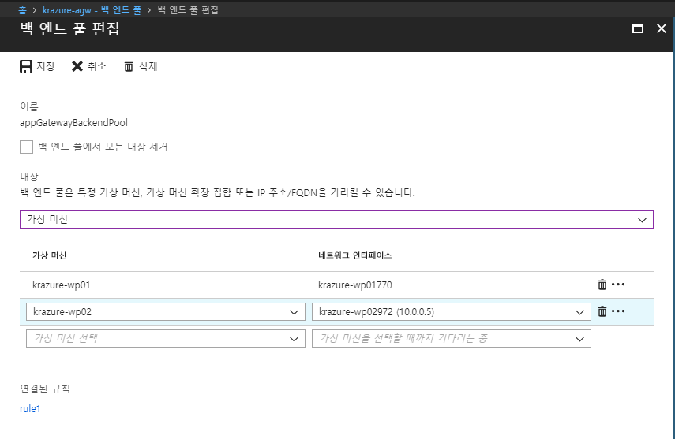

# 1.8 Application Gateway를 이용한 Wordpress 이중화 구성
기본적으로 Cloud를 사용하게 되면 모든 서버는 이중화 이상 구성이 될 수 있도록 응용프로그램을 수정해야 하며, 인프라는 그에 맞도록 설정을 구성할 수 있어야 한다. Application Gateway는 Azure Load Balancer와 다르게 인스턴스 기반으로 동작한다. 따라서 인스턴스의 가용량이 부족하면 서비스 장애로 이어질 수 있기에 운영에 조심해야 한다.

여기서는 L7 기반의 부하 분산 장치인 Application Gateway를 이용하여 Wordpress를 이중화 구성하는 방법에 대해 알아본다.

## Application Gateway 만들기
1. [Azure 웹 콘솔](https://portal.azure.com)에 접속한다.

2. 좌측 메뉴에서 **리소스 만들기**를 클릭한다.

3. **새로 만들기** 블레이드 창이 뜨면 상단의 검색창에 `application gateway`를 입력한 후 엔트키를 입력한다.

4. 검색된 화면에서 `Application Gateway`를 찾아 클릭한다. 클릭하기 전 **게시자** 컬럼에 `Microsoft`로 되어있는지 다시 한 번 확인하자.

5. **Application Gateway** 블레이드 창이 뜨면 가볍게 내용을 확인한 후 하단에 **만들기** 버튼을 클릭한다.

6. **응용프로그램 게이트웨이 만들기** 블레이드 창이 뜨면 **1. 기본 사항**부터 **3. 요약**까지 메뉴가 나오며 각 단계별 설정할 수 있는 블레이드 창이 뜬다.
    > [!메모]
    >
    > **가상 컴퓨터 만들기** 블레이드에 나오는 **1. 기본 사항**부터 **3. 요약** 까지의 내용은 언제든 선택하여 이동하실 수 있다.

7. **기본 사항**에 대해서는 아래와 같이 입력한 후 하단에 **확인** 버튼을 클릭한다.
    - `이름`: Application Gateway의 이름을 입력한다. 여기서는 `krazure-agw`로 입력한다.
    - `계층`: Application Gateway의 계층을 선택한다. 여기서는 **표준**을 선택한다.
    - `SKU 크기`: Application Gateway의 SKU 크기를 선택한다. 여기서는 **소형**을 선택한다.
    - `인스턴스 수`: Application Gateway의 인스턴스 개수를 선택한다. 여기서는 `1`로 입력한다.
    - `구독`: Application Gateway를 만들 구독을 선택한다.
    - `리소스 그룹`: Application Gateway를 만들 리소스 그룹을 선택한다. 여기서는 `krazure-rg`을 선택한다.
    - `위치`: Application Gateway를 생성할 지역을 선택한다. 여기서는 **아시아 남동부**를 선택한다.

8. **설정**에 대해서는 아래와 같이 입력한 후 하단에 **확인** 버튼을 클릭한다.
    - `가상 네트워크`: Application Gateway가 생성될 가상 네트워크를 선택한다. 여기서는 `krazure-vnet`을 선택한다.
    - `서브넷`: Application Gateway가 생성될 서브넷을 선택한다. Application Gateway는 단일 서브넷을 사용하게 되어있으며, 여기서는 `krazure-subnet1`을 선택한다.
    - `IP 주소 유형`: Application Gateway의 위치를 선택한다. 여기서는 **공용**을 선택한다.
    - `공용 IP 주소`: Application Gateway에 연결 될 공용 IP 주소를 선택한다. 여기서는 **새로 만들기**를 선택한 후 텍스트 박스에 `krazure-agw-ip`라고 입력한 후 나머지는 기본 값을 둔다.
    - `프로토콜`: Application Gateway에서 사용할 프로토콜을 선택하낟. 여기서는 **HTTP**를 선택한다.
    - `포트`: Application Gateway에서 사용할 포트를 선택한다. 여기서는 `80`을 입력한다.
    - `HTTP2`: HTTP2의 사용 여부를 체크한다. 여기서는 기본 값을 쓴다.
    - `WAF 계층으로 업그레이드`: **기본 사항**에서 계층을 WAF 계층으로 **표준**을 선택할 시 나타나는 옵션이다. 여기서는 체크박스에 체크를 **하지 않는다.**

9. **요약**에서는 지금까서 설정한 설정들을 확인하고 하단에 **확인** 버튼을 클릭하여 **Application Gateway**를 만든다.

## Application Gateway 설정
10. `krazure-agw`가 만들어 지면 리소스를 찾아 들어간다. Application Gateway의 경우 Azure Load Balancer와 다르게 기본적인 설정이 다 되어있기 때문에 몇 가지만 설정해 주면 된다. **설정**부분에 **백 엔드 풀**을 클릭한다.

11. 이미 생성되어 있는 **appGatewayBackendPool**을 클릭하여 **백 엔드 풀 편집** 블레이드 창을 연다.

12. **백 엔드 풀 편집** 블레이드 창에서 **대상**을 **가상 머신**으로 변경한다.

13. **가상머신**과 **네트워크 인터페이스**를 다음 그림과 같이 설정한 후 상단에 **저장**을 클릭한다.

14. 백 엔드 풀 구성이 완료되면 **개요**를 클릭하여 Application Gateway의 **프런트 엔드 공용 IP 주소**를 복사하여 웹 브라우저에 붙여넣는다. 그리고 앞서 설정한 Wordpress가 정상적으로 뜨는지 확인한다.